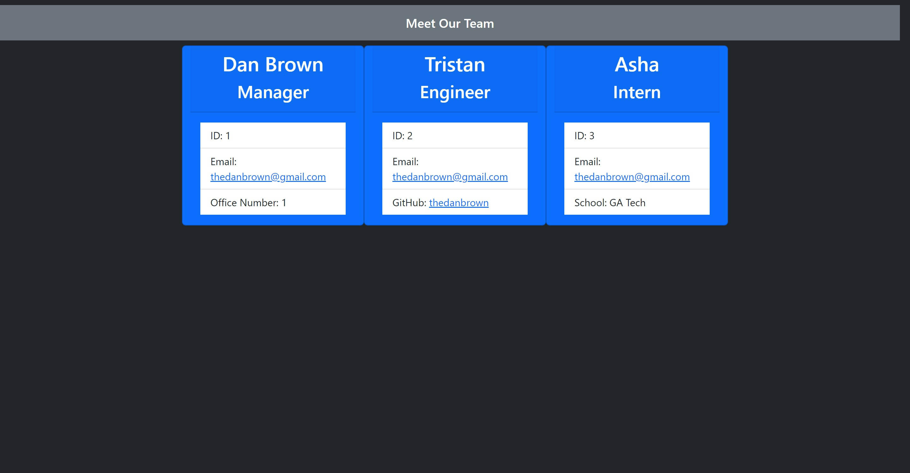

# Team-Profile-Generator
 

  ## Table of Contents
  * [Description](#description)
  * [Installation](#installation)
  * [Usage](#usage)
  * [Links](#links)
  * [License](#license)
  * [Contributing](#contributing)
  * [Questions](#questions)
  
  ## [Description](#table-of-contents)

  This repository contains a command line based Profile generator for members of your Dev team using node.js that will generate an HTML file to deploy and display.

  Uses inquirer for prompts, jest for unit testing, bootstrap for simple styling of the generated html

  

  ## [Installation](#table-of-contents)

  To install: Clone the repository on your local machine and run 'npm install' to install all the node_modules

  ## [Usage](#table-of-contents)

  After installing, run "node index.js" in the Command Line. You will recieve a prompt to add a manager, when the manager is added you are prompted to add any engineers or interns. When all are added, choose finish and your HTML page will be generated!
  
  ## [Links](#table-of-contents)

  * [Repository](https://github.com/Thedanbrown/Team-Profile-Generator)
  * [Usage Video]()

  ## [License](#table-of-contents)

  [MIT](https://opensource.org/licenses/MIT)

  ## [Contributing](#table-of-contents)
  No other contributing parties

  ## [Questions](#table-of-contents)

  You can contact me using the following links:

  [GitHub](https://github.com/Thedanbrown)

  [Email: thedanbrown@gmail.com](mailto:thedanbrown@gmail.com)
